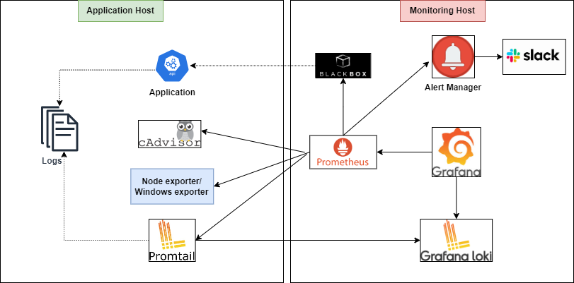
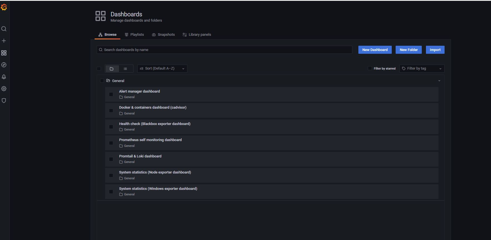
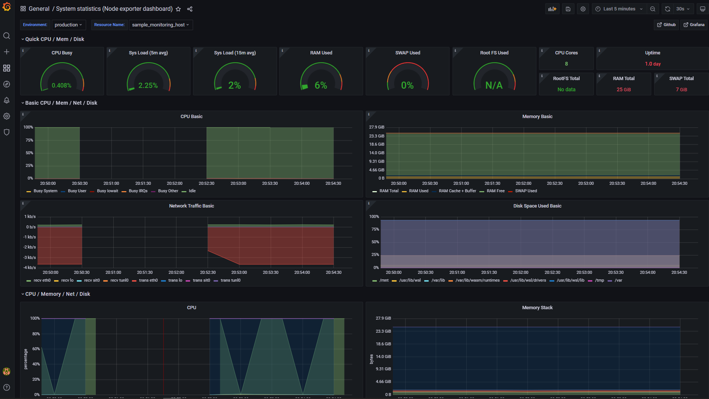
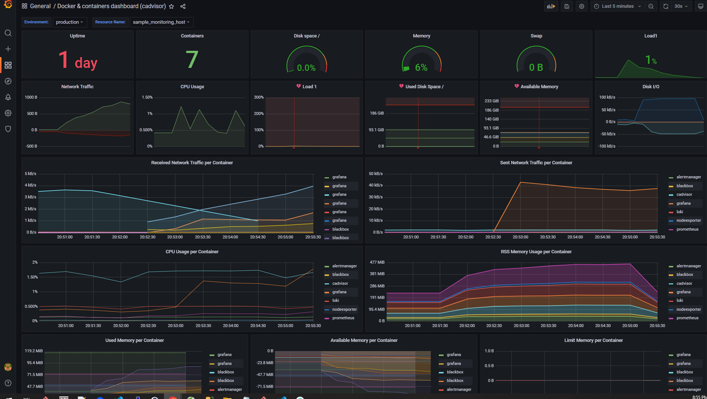
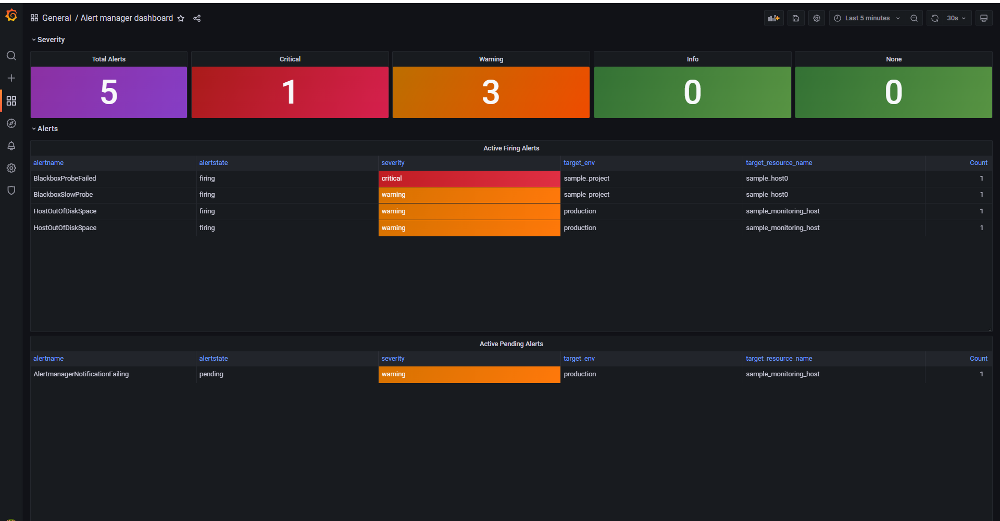

# Monitoring Architecture



In above architecture diagram, there are two parts:

- `Application Host(s)` - This virtual machine has running dockerized application along with node-explorer (to expose system metrics), promtail (to ship/expose logs metrics) and cadvisor (to expose container metrics). The application along with virtual machine host should be monitored by monitoring host, Grafana dashboards should show all metrics and loki explorer should show all application logs.
- `Monitoring Host` - This virtual machine has monitoring prometheus server installed which gets metrics from application host(s) exposed by node-explorer, promtail and cadvistor etc and sends alerts to alertmanager based on prometheus rules.

Note: Monitoring tools can be installed in same application host machine, however, if you have many application host machines, it better to have a dedicated machine for monitoring all hosts.

## Overview

This tool automatically generates deployment package required for monitoring host which includes configuration related to prometheus, blackbox, node-explorer, windows-exporer, cadvisor, loki and grafana.

### Services for Application Host(s)

Please make sure below services are running on application host. (_The configuration and deployment of services related to application host is not covered in this document, however a docker-compose file can be used to install below services in application host machine_)

- Application
  - outputs log to file or console
  - exposes at port 5000 (port can be anything)
- node exporter
  - an agent that gathers os metrics(cpu/memory/disk etc)
  - 9100/metrics
- Promtail
  - an agent that ships the logs from the local system directly to the Loki cluster
  - 9080/metrics: It can also expose endpoint related to custom metrics such as log count
- cadvisor (if application is deployed in docker)
  - Developed & maintained by `Google` which collects real-time monitoring data (resource usage, performance characteristics etc) of containers
  - 8080/metrics

### Services for monitoring host

- prometheus
  - metrics server
  - 9090/metrics
- blackbox exporter
  - network monitoring agent
  - it can monitor several protcols like tcp, ping, http, and so on
  - 9115/metrics
- Alertmanager
  - send notification to somewhere like slack, mail, pagerduty and so on
  - 9093/metrics
- Loki
  - log server
  - it offers log recoding and searching
  - 3100/metrics
- Grafana
  - viewer server
  - it can send query to prometheus, loki, and so on
  - 3000/metrics
- cadvisor (used for docker containers running in monitoring host)
  - Developed & maintained by `Google` which collects real-time monitoring data (resource usage, performance characteristics etc) of containers
  - 8080/metrics
- node exporter (used for monitoring host itself)
  - an agent that gathers os metrics(cpu/memory/disk etc)
  - 9100/metrics

### Generate monitoring host deployment package automatically

To generate the package automatically, please follow below steps:

- Go to [.env](templates/.env) file and fill it with required information related to monitoring host itself and information related to all the application hosts.
- Run the bash script `./scripts/generate_skeleton.sh`
- The package will be generated at folder `_package/monitoring`. (Please refer sample package)
- Now, you can copy `monitoring` folder to remote monitoring host machine.
- The next step is to install `monitoring/host/resource-monitoring.service`

```
	cp monitoring/host/resource-monitoring.service /etc/systemd/system/resource-monitoring.service
	systemctl enable resource-monitoring.service
```

- OR you can run docker compose directly

```
	cd monitoring/docker
	docker-compose up -d
```

- Once all docker containers are running, please validate below urls:

```bash
	#prometheus
	curl -k http://localhost:9090/metrics
	#alertmanager
	curl -k http://localhost:9093/metrics
	#blackbox exporter
	curl -k http://localhost:9115/metrics
	#grafana
	curl -k http://localhost:3000/metrics
	#loki
	curl -k http://localhost:3100/metrics
	#cadvisor (related to monitoring host itself)
	curl -k http://localhost:8080/metrics
	#nodeexporter (related to monitoring host itself)
	curl -k http://localhost:9100/metrics
```

### View grafana dashboards

- Go to `http://<monitoring-host-ip-address>:3000` (eg: http://localhost:3000)
- Username is `admin` and password is `password`
- In left panel, go to `Dashboards` -> `Manage`
- It will show you all the available dashboards
- You can mark the dashboard as favorite

### View logs in loki

- Go to `http://<monitoring-ip-address>:3000` (eg: http://localhost:3000)
- In left panel, go to `Explore` icon
- Select `Loki` from dropdown list
- Click on `Log browser`
- Select the labels (you can filter based on label selection)
- Run query

**Grana Dashboards**


**Grana Node exporter Dashboard**


**Grana Cadvisor Dashboard**


**Grana Alertmanager Dashboard**


**Grafana Loki**

